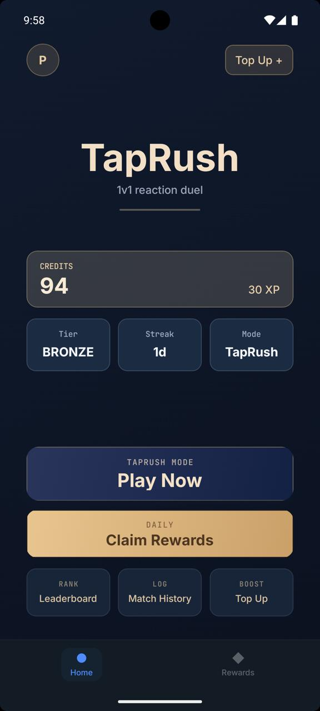
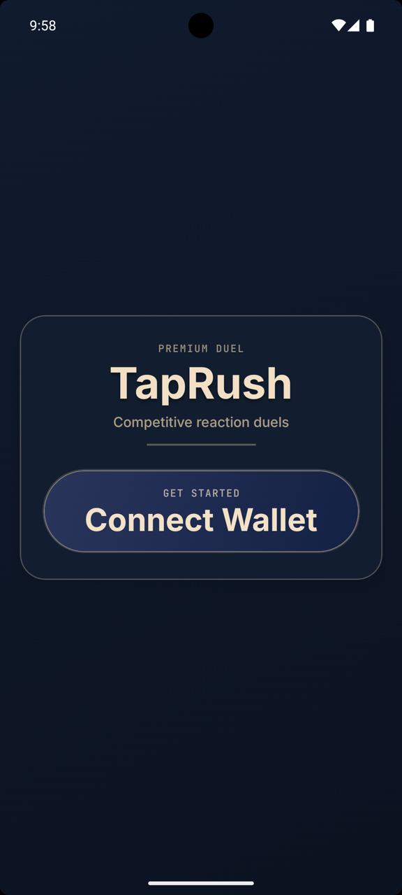
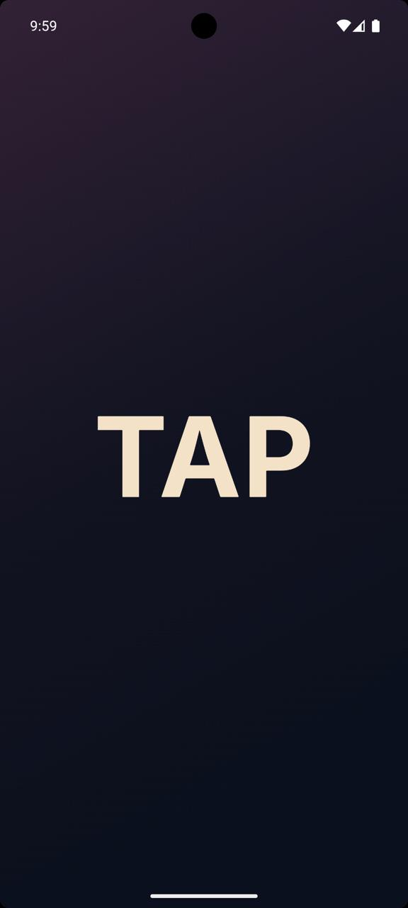
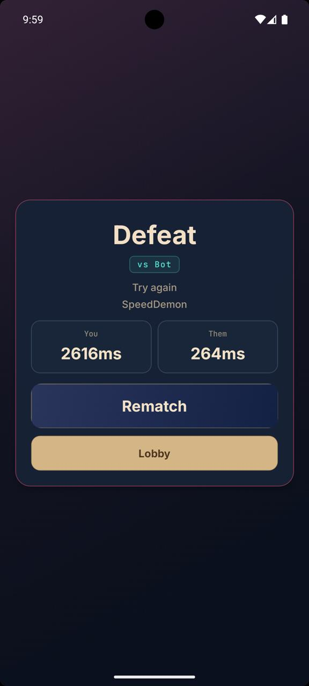

# Tap-or-Trap

A mobile-only quick-draw betting game on Solana. Two players, two phones, one tap. Wager SOL, wait for the haptic buzz, and the first finger after the buzz wins the pot. Tap too early and you forfeit.

<p align="center">
  
  
  
  
</p>

## How it works

1. Top up once with SOL — credits are deducted per match, no per-match on-chain transactions.
2. Find an opponent: random matchmaking or share a 6-character invite code.
3. Both phones enter a standoff screen. After a random 2–15s delay, both phones vibrate at the same instant.
4. First tap **after** the vibration wins. Tap **before** = instant forfeit.
5. Winner takes the pot minus rake.

## Architecture

```
┌──────────────┐         ┌──────────────────┐         ┌──────────────┐
│   PHONE A    │◄──HTTP──►│  BACKEND SERVER  │◄──HTTP──►│   PHONE B    │
│              │  polling │  (source of      │  polling │              │
└──────────────┘         │   truth)         │         └──────────────┘
                         └────────┬─────────┘
                                  │ RPC
                                  ▼
                        ┌────────────────────┐
                        │  SOLANA (mainnet)  │
                        │  Treasury · Credits│
                        │  Escrow PDAs       │
                        └────────────────────┘
```

- **No WebSockets** — clients short-poll the backend (300ms during matchmaking, 150ms during standoff).
- **Backend is single source of truth** for match phase, draw timing, and tap arbitration.
- **No per-match on-chain transactions** — top-up once, play many. Settlement is batched.


## Tech stack

**Mobile app** (`app/`)
- Expo / React Native (TypeScript)
- Solana Mobile Wallet Adapter
- `expo-haptics` for the draw buzz, `expo-sensors` for tap timing

**Backend** (`backend/`)
- Node.js + Express 5
- PostgreSQL + Drizzle ORM
- JWT auth via wallet signature (tweetnacl)
- `@solana/web3.js` for RPC

**On-chain**
- Anchor program managing Treasury, PlayerCredits, MatchEscrow, and Leaderboard PDAs
- Program ID: `HKUeBck47FAtguvzH1oceCshmMSxgXqKHTnN2RmcTNsH`

## Project layout

```
app/                  Expo / React Native client
  src/screens/        Home, Game, Missions, Settings
  src/components/
  src/services/       API + wallet adapter
backend/              Node.js API server
  routes/             auth, credits, matchmaking, match, stats, daily
  services/           matchmaker, arbitrator, settler, draw-timer, cleanup
  db/                 Drizzle schema + migrations
  solana/             keypair + chain helpers
PLAN.md               Full architecture spec
DESIGN_SYSTEM.md      Visual language
```

## Running locally

### Backend

```bash
cd backend
cp .env.example .env       # fill in JWT_SECRET, DATABASE_URL, etc.
npm install
npm run db:migrate
npm run dev                # http://localhost:3000
```

Environment variables (see [.env.example](backend/.env.example)):
- `PORT` — defaults to 3000
- `SOLANA_RPC_URL` — Solana RPC endpoint
- `PROGRAM_ID` — on-chain program ID
- `BACKEND_KEYPAIR_PATH` — path to backend signer keypair
- `JWT_SECRET` — must be ≥32 chars
- `DATABASE_URL` — PostgreSQL connection string

### Mobile app

```bash
cd app
npm install
npm start                  # then press i (iOS) or a (Android)
```

The client auto-detects dev mode and points to:
- `http://10.0.2.2:3000` on Android emulator
- `http://localhost:3000` on iOS simulator
- `https://api.taprush.app` in production

Update [`app/src/constants.ts`](app/src/constants.ts) to point to a different backend.

### Production (Docker)

```bash
docker compose -f docker-compose.production.yml up -d
```

## Game constants

| Setting | Value |
| --- | --- |
| Top-up cost | 0.01 SOL |
| Credits per top-up | 5 plays |
| Wager per side | 0.01 SOL |
| Min human reaction | 80 ms (taps faster are flagged) |
| Draw delay range | 2–15 s |

## API

Public:
- `POST /auth/nonce` · `POST /auth/verify` — wallet-signature login
- `GET /health`

Authenticated (Bearer JWT):
- `/credits` — balance, top-up confirmation
- `/matchmaking` — queue join/leave, room create/join
- `/match` — standoff state, tap submit, result
- `/stats` · `/daily` — leaderboard, daily missions

